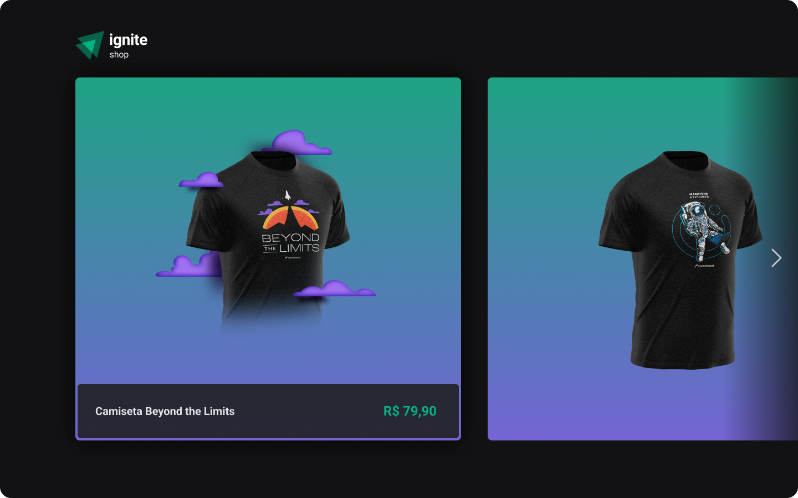

# Shop



## Sobre

O projeto shop é um marketplace de camisetas integrado com Stripe para gerenciar os produtos e efetuar pagamentos, o projeto usa vários conceitos do next js com SSR, SSG entre outros.

## Instalação

```bash title="Clone o repositório"
git clone https://github.com/manoguii/shop.git
```

- Para rodar o projeto localmente
  1. Primeiro você precisa criar uma conta nas plataformas na qual o projeto tem integração, o projeto usa o [Stripe](https://stripe.com/br) para gerenciar os pagamentos
  2. Crie um arquivo ```.env.local``` na raiz do projeto e preencha as variáveis ambiente, o exemplo de como deve ficar esta em ```.env.example```
  3. Instale as dependências ```npm install```
  4. Execute a aplicação. ```npm run dev```
  5. Acesse `http://localhost:3000`

## Tecnologias utilizadas 👩🏻‍💻

- [ReactJS](https://reactjs.org/)
- [NextJS](https://nextjs.org/)
- [TypeScript](https://www.typescriptlang.org/)

---  

<center>Made with 💙 by Guilherme David</center>
